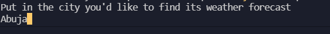
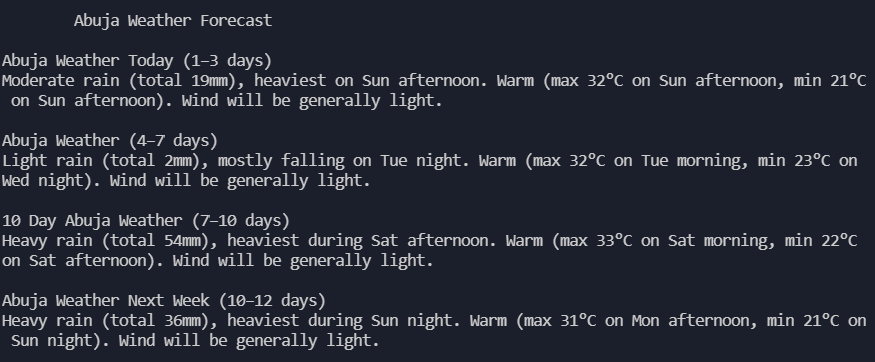
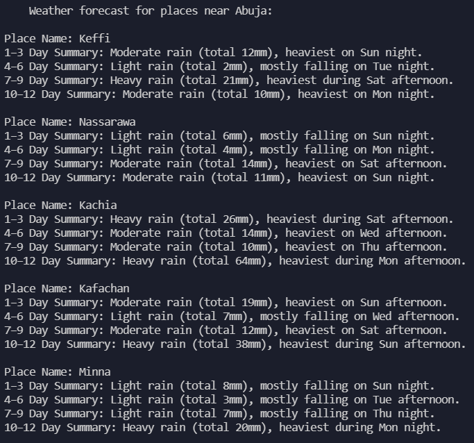

# Weather Scraper

> This weather scraper formats important weather forecast information for any needed city.

This Weather Scraper used [12 Day Weather Forecast Worldwide](https://www.weather-forecast.com/) as the base website for the scraping.

As indicated above, when the program is run it prompts the user to put in a desired city whose weather forecast they wish to receive. In this case for example, the city is `Abuja`. Abuja is the Capital of Nigeria.

After the user's city has been correctly retrieved, the next display shows a list-like forecast of the user's desired city with a heading like `Abuja Weather Forecast`. It comes in four(4) sub-headings: `1 - 3 days` which includes the day of the request, `4 - 7 days`, `7 - 10 days` and `10 - 12 days` - with each containing some description of what the weather forecast for that period is.

Scrolling down further, weather forecast for five(5) cities near the user's city can be found too. In this case, for example, the five cities are `Keffi`, `Nasarawa`, `Kachia`, `Kafachan` and `Minna`. Now, each city contains sub-heading of the days intervals and a rather brief summary of the weather forecast for each interval.

## Built With

- Major language: Ruby
- Important Gems: HTTParty, Nokogiri

## Getting Started

### Prerequisites
- Ruby must be installed
- Internet

### Setup

#### To get a local copy up and running simply follow the next step.
Clone this repository on to your local PC
- Click on the `Code` green button
- By the right end of the read-only input containing the repository link click the clipboard icon to copy the link
- In your local PC, open your terminal in the folder you would like to clone the repository into
- Clone the repository with the command: `git clone (copied link)`; like so: `git clone https://github.com/TedLivist/weather-scraper.git`
- After the clone, type in the command `cd weather-scraper` to access the directory on the terminal

#### To setup for RSpec testing
- While in the directory on the terminal run `bundle install`
- If you do not have the `rspec` gem installed, run `gem install rspec` on the terminal to install it

### Install
While still on the terminal and in the weather-scraper directory
- Run the `bundle install` command to install all the gems in the Gemfile

### Usage
- Type `ruby bin/scraper.rb` in the terminal to run this weather scraper program
- Type in the name of city you wish to fetch. <b>Note: if city name contains space use hyphen(-) in place of space</b>
- Give the program a few seconds to fetch the data
- The first heading contains weather forecast data for your requested city
- The next heading contains weather forecast for cities near your requested city
- If you do not request a meaningful city, the program would not return anything

### Run tests
There are two options:
1. Run all tests simply by typing `rspec` or
2. Run test for individual files by typing `rspec spec/[filename]_spec.rb` to run the tests for the corresponding `lib/filename.rb` file like so: `rspec spec/location_weather_spec.rb`

## Author

👤 **Teddy-Livingstone Ememandu**

- [GitHub](https://github.com/TedLivist)
- [Twitter](https://twitter.com/iamxted)
- [LinkedIn](https://linkedin.com/in/tememandu)

## 🤝 Contributing

Contributions, issues, and feature requests are welcome!

Feel free to check the [issues page](issues/).

## Show your support

Give a ⭐️ if you like this project!

## Acknowledgments

- [zayne](https://www.youtube.com/channel/UCkoEStUK7wxmZef2DcPuCAQ)
